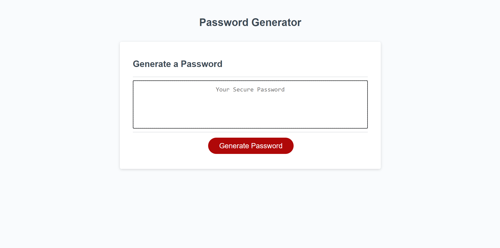

# Homework_03_Password_Generator
Homework Assignment 03 Due EOD 9/17/2021

The goal of this homework assignment was to deploy an application that generates a random password for a user that meets their selected criteria. The user should be able to choose:
* The length of their password between 8 and 128 characters
* The types of characters to be included in the password
    * Lower Case
    * Upper Case
    * Special Characters
    * Numerical Characters

You can find the deployed application here: https://joshuakwatkins.github.io/Homework_03_Password_Generator/

